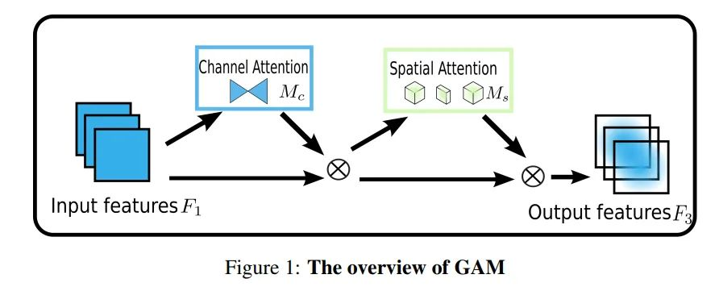
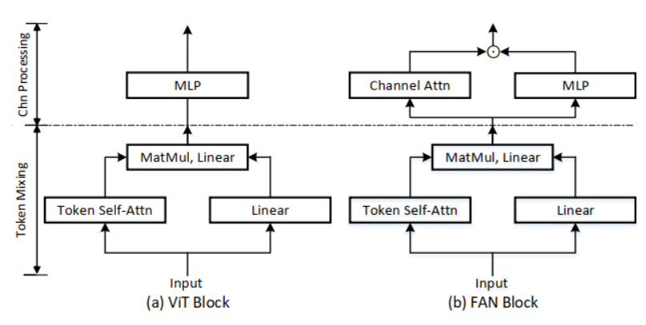
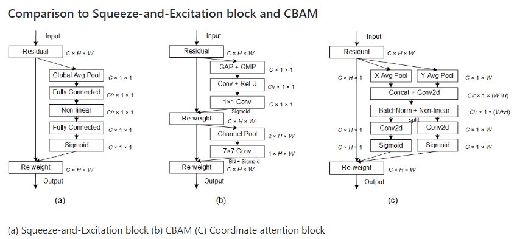
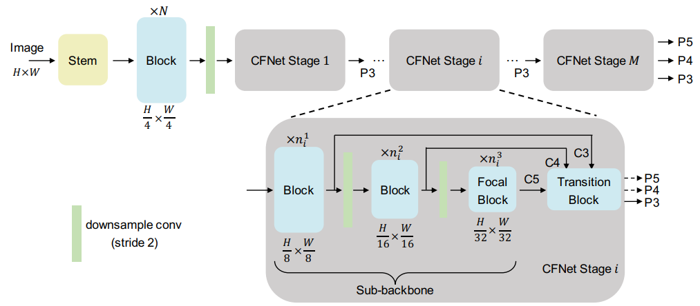

# attention-set
# 各种即插即用模块的实现

各种即插即用模块详解，请扫描二维码，关注公众号AI八倍镜查看。

该公众号共分为三个栏目：资源精选、科研导航、交流学习。

- 资源精选
  - 论文在线（为最新主流科研论文详解）
  - 技术栈（本仓库所提即插即用模块详解位于技术栈中）
  - 科研助手（为一些科研工具解析以及下载提供）
  - 数据集收集（提供一些公开数据集下载）
- 科研导航
  - IF查与投（提供SCI期刊影响因子查询）
  - SCI期刊导航（提供SCI期刊检索以及分区、是否预警等信息）
  - 中科院分区导航（提供最新SCI期刊中科院分区信息）
\
\
\
\
\
\- [attention-set目录](#attention-set)
- [各种即插即用模块的实现](#各种即插即用模块的实现)
    - [0. GAM 注意力](#0-gam-注意力)
    - [1、STN模块](#1stn模块)
    - [2、SE模块](#2se模块)
    - [3、ODConv动态卷积](#3odconv动态卷积)
    - [4、完全注意力 \[FAN注意力\]](#4完全注意力-fan注意力)
    - [5、CA注意力](#5ca注意力)
    - [6、自适应空间特征融合(ASFF)](#6自适应空间特征融合asff)
    - [7、全新多尺度融合(CFNet  2023年)](#7全新多尺度融合cfnet--2023年)
    - [8、无参数注意力机制（simAM）](#8无参数注意力机制simam)
    - [9、卷积三重注意力模块(Rotate to Attend: Convolutional Triplet Attention Module)](#9卷积三重注意力模块rotate-to-attend-convolutional-triplet-attention-module)

### 0. GAM 注意力

论文地址：https://arxiv.org/pdf/2112.05561v1.pdf

摘要：为了提高计算机视觉任务的性能，人们研究了各种注意力机制。然而，以往的方法忽略了保留通道和空间方面的信息以增强跨维度交互的重要性。因此，本文提出了一种通过减少信息弥散和放大全局交互表示来提高深度神经网络性能的全局注意力机制。本文引入了3D-permutation 与多层感知器的通道注意力和卷积空间注意力子模块。在CIFAR-100和ImageNet-1K上对所提出的图像分类机制的评估表明，本文的方法稳定地优于最近的几个注意力机制，包括ResNet和轻量级的MobileNet。

### 1、STN模块

论文地址：https://proceedings.neurips.cc/paper/2015/file/33ceb07bf4eeb3da587e268d663aba1a-Paper.pdf

摘要：卷积神经网络定义了一类非常强大的模型，但仍受限于缺乏以计算和参数效率的方式对输入数据进行空间不变的能力。在这项工作中，我们引入了一个新的可学习模块--空间变换器，它明确地允许在网络中对数据进行空间操作。这个可区分的模块可以插入到现有的卷积结构中，使神经网络具有主动对特征图进行空间转换的能力，以特征图本身为条件，不需要任何额外的训练监督或对优化过程的修改。我们表明，使用空间变换器的结果是，模型学会了对平移、缩放、旋转和更通用的扭曲的不变性，从而在一些基准和一些变换类别上获得了最先进的性能。

源码：[torch](./1-STN/pytorch)  参考：[AlexHex7/Spatial-Transformer-Networks_pytorch](https://github.com/AlexHex7)

源码：[tensorflow](./1-STN/tensorflow/) 参考：[kevinzakka/spatial-transformer-network](https://github.com/kevinzakka)

### 2、SE模块

论文地址：https://openaccess.thecvf.com/content_cvpr_2018/papers/Hu_Squeeze-and-Excitation_Networks_CVPR_2018_paper.pdf

摘要：卷积神经网络是建立在卷积操作之上的，它通过在局部感受野内将空间和通道信息融合在一起来提取信息特征。为了提高网络的表示能力，最近的一些方法显示了加强空间编码的好处。在这项工作中，我们把重点放在通道关系上，并提出了一个新的结构单元，我们称之为 "挤压和激励"（SE）块，它通过明确地重新校准通道特征反应来适应性地调整 通过明确地模拟通道之间的相互依存关系，自适应地重新校准通道的特征响应。我们证明，通过将这些模块堆叠在一起 我们证明，通过将这些模块堆叠在一起，我们可以构建SENet架构，在具有挑战性的数据集上有非常好的通用性。最重要的是，我们发现SE模块对现有的最新技术产生了明显的性能改进。我们发现，SE块能以最小的额外计算成本为现有的最先进的深度架构带来重大的性能改进。SENets构成了我们的ILSVRC的基础 2017年分类报告的基础，该报告赢得了第一名，并且 显著降低了前五名的误差至2.251%，与2016年的获奖作品相比，实现了25%的相对改进。

源码：[torch](./2-SENet/pytorch)  参考：[miraclewkf/SENet-PyTorch](https://github.com/miraclewkf)

源码： [tensorflow](./2-SENet/tensorflow/) 参考：[taki0112/SENet-Tensorflow](https://github.com/taki0112)

### 3、ODConv动态卷积

论文地址：https://openreview.net/pdf?id=DmpCfq6Mg39

摘要：在每个卷积层中学习单个静态卷积核是现代卷积神经网络 (CNN) 的常见训练范式。相反，最近对动态卷积的研究表明，学习 n 个卷积核的线性组合，该卷积核加权与其输入相关的注意力可以显着提高轻量级 CNN 的准确性，同时保持有效的推理。然而，我们观察到现有的工作通过内核空间的一维（关于卷积核数）赋予卷积核动态属性，但其他三个维度（关于空间大小、输入通道数和输出通道数）每个卷积核）都被忽略了。受此启发，我们提出了全维动态卷积（ODConv），一种更通用但更优雅的动态卷积设计，以推进这一研究方向。ODConv 利用一种新颖的多维注意力机制和并行策略，在任何卷积层沿内核空间的所有四个维度学习卷积内核的互补注意力。作为常规卷积的直接替代品，ODConv 可以插入到许多 CNN 架构中。在 ImageNet 和 MS-COCO 数据集上的大量实验表明，ODConv 为各种流行的 CNN 主干网（包括轻量级和大型主干网）带来了可靠的准确度提升，例如，3.77%~5.71%|1.86%~3.72% 的绝对 top-1 改进MobivleNetV2|ImageNet 数据集上的 ResNet 系列。有趣的是，由于其改进的特征学习能力，即使只有一个内核的 ODConv 也可以与现有的具有多个内核的动态卷积对应物竞争或优于现有的动态卷积对应物，从而大大减少了额外的参数。此外，ODConv 在调制输出特征或卷积权重方面也优于其他注意模块。代码和模型将在https://github.com/OSVAI/ODConv。

源码： [torch](./3-ODConv)  参考：[OSVAI/ODConv](https://github.com/OSVAI/ODConv)

### 4、完全注意力 [FAN注意力]

论文地址：https://arxiv.org/abs/2204.12451

摘要：最近的研究表明，视觉变换器(ViTs)表现出强大的鲁棒性对各种腐败。虽然这种特性在一定程度上归因于自我注意机制，但仍缺乏系统的认识。本文研究了自我注意在鲁棒表征学习中的作用。我们的研究是由视觉变换器中新兴的视觉分组的有趣特性所激发的，这表明自我注意可以通过改进中层表征来促进健壮性。我们进一步提出了一系列完全注意网络(FAN) ，它们通过结合注意通道处理设计来加强这种能力。我们在不同的层次主干上全面验证了设计。我们的模型在 ImageNet-1k 和 ImageNet-C 上实现了最先进的87.1% 的准确率和35.8% 的 mCE，参数为76.8 M。我们还展示了最先进的准确性和鲁棒性在两个下游任务: 语义分割和目标检测。

源码：  [torch](./4-FAN)  参考：[NVlabs/FAN](https://github.com/NVlabs/FAN)

### 5、CA注意力

论文地址：https://arxiv.org/abs/2103.02907

摘要：最近关于移动网络设计的研究已经证明了信道注意力（例如，挤压和激励注意力）对于提升模型性能的显著有效性，但它们通常忽略了位置信息，这对于生成空间选择性注意力图很重要。在本文中，我们通过将位置信息嵌入到信道注意力中，提出了一种新的移动网络注意力机制，我们称之为“协调注意力”。与通过2D全局池将特征张量转换为单个特征向量的通道注意力不同，坐标注意力将通道注意力分解为两个1D特征编码过程，分别沿两个空间方向聚合特征。以这种方式，可以沿着一个空间方向捕获长距离依赖性，同时可以沿着另一个空间方位保存精确的位置信息。然后将得到的特征图分别编码成一对方向感知和位置敏感的注意力图，该注意力图可以互补地应用于输入特征图以增强感兴趣对象的表示。我们的协调注意力很简单，可以灵活地插入经典的移动网络，如MobileNetV2、MobileNeXt和EfficientNet，几乎没有计算开销。大量实验表明，我们的协调注意力不仅有利于ImageNet分类，更有趣的是，它在下游任务中表现得更好，例如对象检测和语义分割。

源码： [torch](./5-CA/torch)  参考：[houqb/CoordAttention](https://github.com/Andrew-Qibin/CoordAttention)

源码： [tensorflow](./5-CA/tensorflow) 参考：[Zhengtq/CoordAttention_tensorflow](https://github.com/Zhengtq/CoordAttention_tensorflow)

### 6、自适应空间特征融合(ASFF)

论文地址：https://arxiv.org/abs/1911.09516

摘要：金字塔特征表示是解决物体检测中尺度变化问题的常用方法。然而，不同特征尺度之间的不一致性是基于特征金字塔的单镜头检测器的主要限制。在这项工作中，我们提出了一种新的数据驱动的金字塔特征融合策略，称为自适应空间特征融合（ASFF）。它学习了空间过滤冲突信息以抑制不一致性的方法，从而提高了特征的尺度不变性，并引入了几乎免费的推理开销。通过ASFF策略和YOLOv3的坚实基线，我们在MS COCO数据集上实现了最佳的速度精度权衡，在60 FPS时报告38.1%的AP，在45 FPS时报告42.4%的AP，而在29 FPS时报告43.9%的AP。

源码：  [torch](./6-ASFF)  参考：[GOATmessi7/ASFF](https://github.com/GOATmessi7/ASFF)

### 7、全新多尺度融合(CFNet  2023年)

论文地址：https://arxiv.org/pdf/2302.06052.pdf

摘要：多尺度特征对于密集预测任务至关重要，包括对象检测、实例分割和语义分割。现有的最先进的方法通常首先通过分类主干提取多尺度特征，然后通过轻量级模块（例如FPN中的融合模块）融合这些特征。然而，我们认为，通过这种范式融合多尺度特征可能不够，因为与重分类主干相比，为特征融合分配的参数是有限的。为了解决这个问题，我们提出了一种用于密集预测的级联融合网络（CFNet）结构。除了用于提取初始高分辨率特征的主干和几个块之外，我们还引入了几个级联阶段来在CFNet中生成多尺度特征。每个阶段包括用于特征提取的子主干和用于特征集成的极其轻量级的过渡块。这种设计使得可以用整个主干的大量参数来更深入和有效地融合特征。在对象检测、实例分割和语义分割方面的大量实验验证了所提出的CFNet的有效性。

源码：  [torch](./7-CFNet)  参考：[zhanggang001/CFNet](https://github.com/zhanggang001/CFNet)  (仅有地址，尚未提供源码。若道友看到仓库更新还请公众号联系我们，及时更新。手动笔芯~~)

### 8、无参数注意力机制（simAM）

论文地址：http://proceedings.mlr.press/v139/yang21o/yang21o.pdf

摘要-在本文中，我们提出了一个概念简单，但非常有效的注意模块卷积神经网络(simAM)。与现有的通道和空间注意模块相比，我们的模块在不增加原始网络参数的情况下，推导出特征映射的三维注意权重。具体来说，我们在一些著名的神经科学理论的基础上，提出优化能量函数，以找到每个神经元的重要性。我们进一步推导了能量函数的快速闭式解，并证明了该解可以在少于10行代码中实现。该模块的另一个优点是，大多数运算符都是根据已定义的能量函数的解决方案选择的，避免了过多的结构调优工作。对各种视觉任务的定量评估表明，该模块具有较强的灵活性和有效性，可以提高许多视觉任务的表示能力。

源码：  [torch](./8-simAM/torch)  参考：[ZjjConan/SimAM](https://github.com/ZjjConan/SimAM) 
源码：  [tensorflow](./8-simAM/tensorflow)  参考：[cpuimage/SimAM](https://github.com/cpuimage/SimAM) 

### 9、卷积三重注意力模块(Rotate to Attend: Convolutional Triplet Attention Module)

论文地址：https://arxiv.org/abs/2010.03045

摘要-由于注意机制具有在不同通道或空间位置之间建立相互依赖关系的能力，近年来注意机制已被广泛地研究和应用于各种计算机视觉任务中。本文研究了轻量级但有效的注意机制，提出了三重注意，这是一种利用三分支结构捕捉交叉维度相互作用来计算注意权重的新方法。对于输入张量，三重态注意通过旋转运算和残差变换建立维间依赖关系，并以可忽略的计算开销对信道间和空间信息进行编码。我们的方法简单有效，可以很容易地插入到经典的骨干网络作为一个附加模块。我们证明了我们的方法在各种具有挑战性的任务中的有效性，包括在 ImageNet-1k 上的图像分类和在 MSCOCO 和 PASCAL VOC 数据集上的目标检测。此外，我们提供了广泛的洞察三联体注意的表现，通过视觉检查的 gradCAM 和 gradCAM + + 的结果。该方法的实证评估支持我们的直觉，即在计算注意力权重时，跨维度捕捉依赖性的重要性。

源码：  [torch](./9-triplet)  参考：[landskape-ai/triplet-attention](https://github.com/landskape-ai/triplet-attention) 