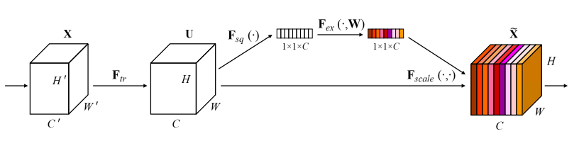

# attention-set
# 各种即插即用模块的实现

### 1. GAM 注意力

论文地址：https://arxiv.org/pdf/2112.05561v1.pdf

摘要：为了提高计算机视觉任务的性能，人们研究了各种注意力机制。然而，以往的方法忽略了保留通道和空间方面的信息以增强跨维度交互的重要性。因此，本文提出了一种通过减少信息弥散和放大全局交互表示来提高深度神经网络性能的全局注意力机制。本文引入了3D-permutation 与多层感知器的通道注意力和卷积空间注意力子模块。在CIFAR-100和ImageNet-1K上对所提出的图像分类机制的评估表明，本文的方法稳定地优于最近的几个注意力机制，包括ResNet和轻量级的MobileNet。

### 2、STN模块

论文地址：https://proceedings.neurips.cc/paper/2015/file/33ceb07bf4eeb3da587e268d663aba1a-Paper.pdf

摘要：卷积神经网络定义了一类非常强大的模型，但仍受限于缺乏以计算和参数效率的方式对输入数据进行空间不变的能力。在这项工作中，我们引入了一个新的可学习模块--空间变换器，它明确地允许在网络中对数据进行空间操作。这个可区分的模块可以插入到现有的卷积结构中，使神经网络具有主动对特征图进行空间转换的能力，以特征图本身为条件，不需要任何额外的训练监督或对优化过程的修改。我们表明，使用空间变换器的结果是，模型学会了对平移、缩放、旋转和更通用的扭曲的不变性，从而在一些基准和一些变换类别上获得了最先进的性能。

源码：

[torch](./STN/pytorch)  参考：[AlexHex7](https://github.com/AlexHex7)/**[Spatial-Transformer-Networks_pytorch]**

[tensorflow](./STN/tensorflow/) 参考：[kevinzakka](https://github.com/kevinzakka)/**[spatial-transformer-network]**

### 3、SE模块

论文地址：https://openaccess.thecvf.com/content_cvpr_2018/papers/Hu_Squeeze-and-Excitation_Networks_CVPR_2018_paper.pdf

摘要：卷积神经网络是建立在卷积操作之上的，它通过在局部感受野内将空间和通道信息融合在一起来提取信息特征。为了提高网络的表示能力，最近的一些方法显示了加强空间编码的好处。在这项工作中，我们把重点放在通道关系上，并提出了一个新的结构单元，我们称之为 "挤压和激励"（SE）块，它通过明确地重新校准通道特征反应来适应性地调整 通过明确地模拟通道之间的相互依存关系，自适应地重新校准通道的特征响应。我们证明，通过将这些模块堆叠在一起 我们证明，通过将这些模块堆叠在一起，我们可以构建SENet架构，在具有挑战性的数据集上有非常好的通用性。最重要的是，我们发现SE模块对现有的最新技术产生了明显的性能改进。我们发现，SE块能以最小的额外计算成本为现有的最先进的深度架构带来重大的性能改进。SENets构成了我们的ILSVRC的基础 2017年分类报告的基础，该报告赢得了第一名，并且 显著降低了前五名的误差至2.251%，与2016年的获奖作品相比，实现了25%的相对改进。

源码：

[torch](./SENet/pytorch)  参考：[miraclewkf](https://github.com/miraclewkf)/**[SENet-PyTorch]**

[tensorflow](./SENet/tensorflow/) 参考：[taki0112](https://github.com/taki0112)/**[SENet-Tensorflow]**